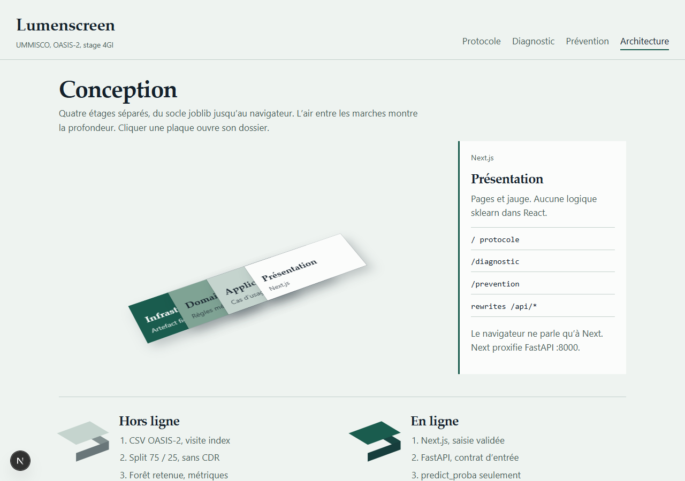

# Rapport de stage -- Conversion MCI vers demence

Template ENSP recale en **rapport de stage de recherche**. Code et démo Lumenscreen : [https://github.com/zoom-BT/lumenscreen-oasis-research-intern](https://github.com/zoom-BT/lumenscreen-oasis-research-intern).



## Compiler

Ouvrir `memoirthesis.tex` dans TeXstudio ou VS Code (LaTeX Workshop).

Meme toolchain que Open2Work (`pdflatex` MiKTeX). Biblatex demande **biber** :

```
pdflatex memoirthesis
biber memoirthesis
pdflatex memoirthesis
pdflatex memoirthesis
```

## Contenu

| Fichier | Role |
|---|---|
| `frontmatter/title.tex` | Page de garde ENSP bilingue |
| `frontmatter/title2.tex` | Page logos UMMISCO + ENSPY |
| `chapters/introduction/` | Contexte, problematique, question, hypothese, aims |
| `chapters/chapter02/` | Concepts + etat de l art |
| `chapters/chapter03/` | Donnees et protocole |
| `chapters/chapter04/` | Travail realise, limites |
| `chapters/biblio/biblio.bib` | References du stage |

Les tableaux demographiques et les AUC empiriques restent a remplir apres inventaire des extraits.
