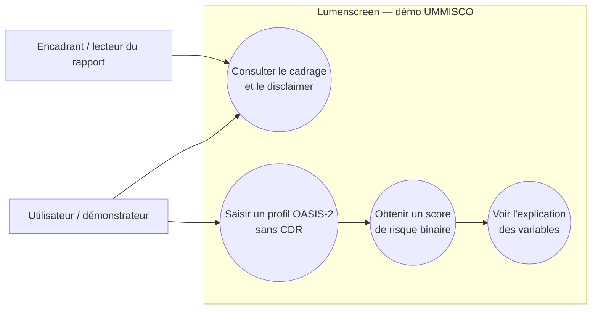
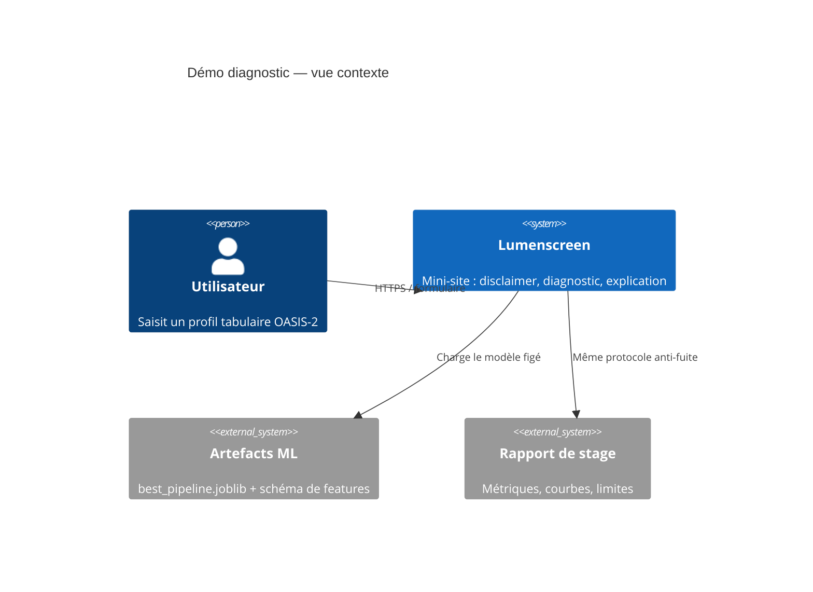
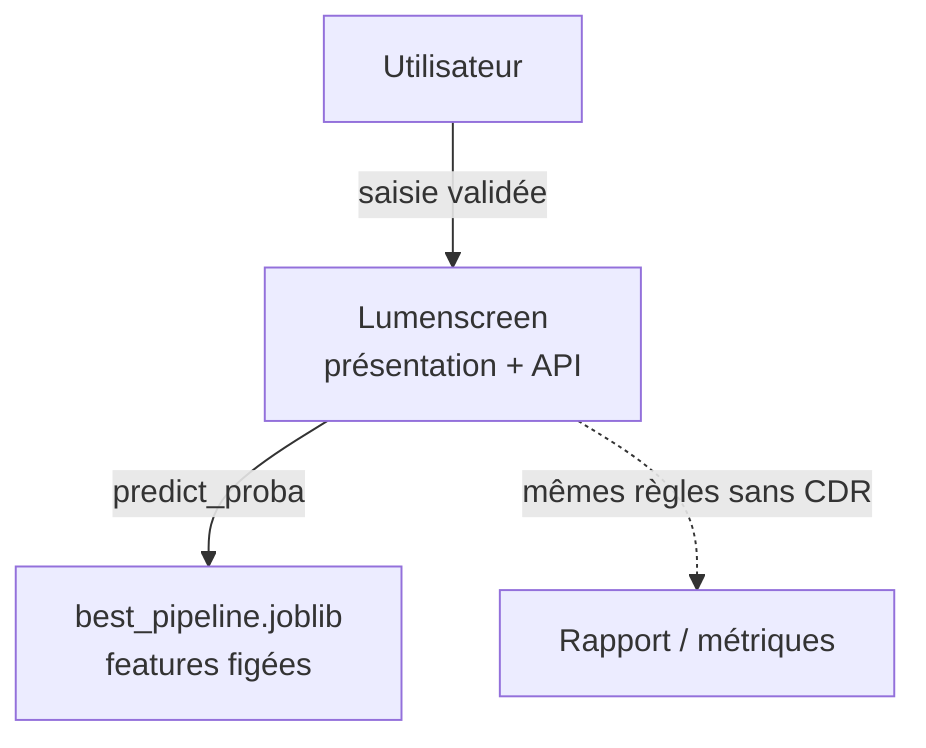
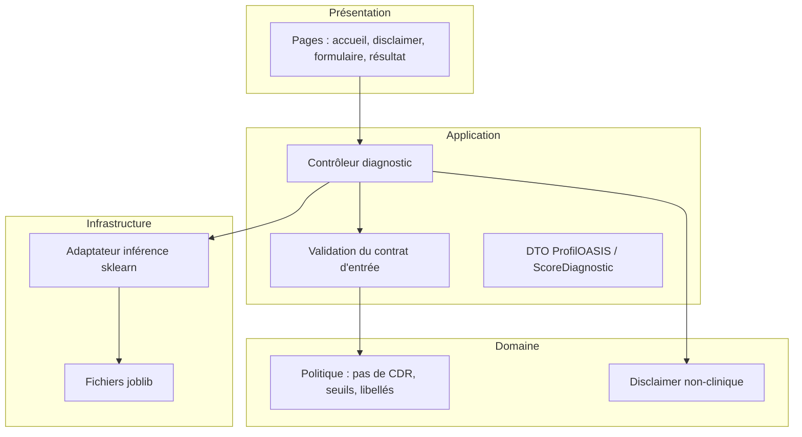
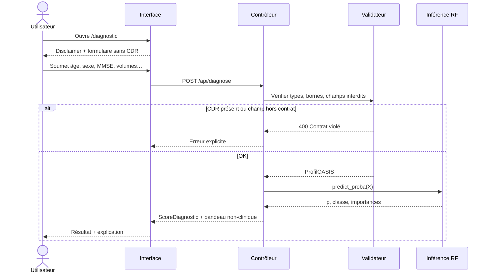
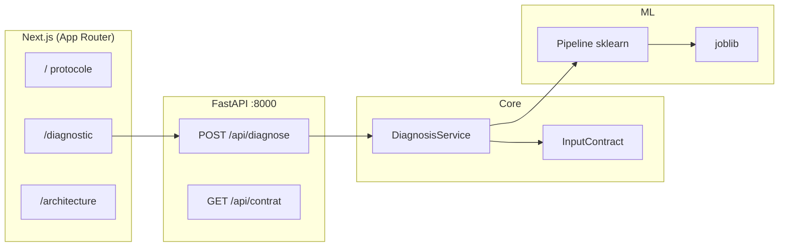
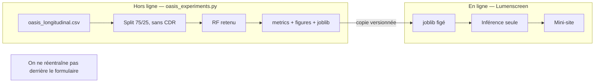
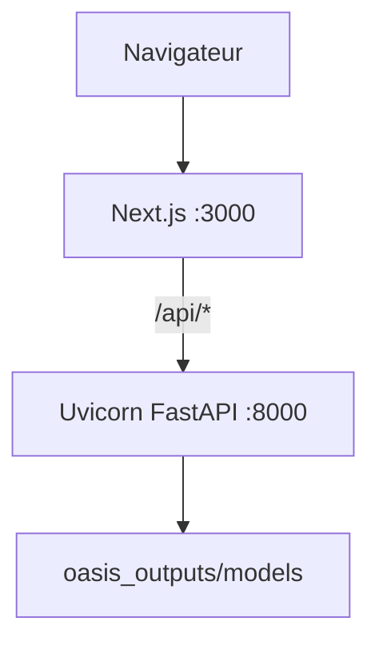

# Diagrammes — démo diagnostic OASIS-2 (conception logicielle)

Exporter chaque bloc sur [mermaid.live](https://mermaid.live) → PNG/SVG.  
Légendes pour le rapport : **Figures 5.3 à 5.8**.

Principes illustrés : séparation des responsabilités, contrat d’entrée **sans CDR**, entraînement ≠ inférence, disclaimer non clinique.

---

## FIG 5.3 — Cas d’utilisation

---

## FIG 5.4 — Contexte (C4 niveau 1)

Si C4 ne passe pas dans mermaid.live, utiliser celui-ci :

---

## FIG 5.5 — Architecture en couches

---

## FIG 5.6 — Séquence du diagnostic

---

## FIG 5.7 — Composants

---

## FIG 5.8 — Entraînement vs inférence (MLOps léger)

---

## FIG 5.9 — Déploiement local

Export : thème clair, fond blanc, PNG 1920 px de large pour le LaTeX.
